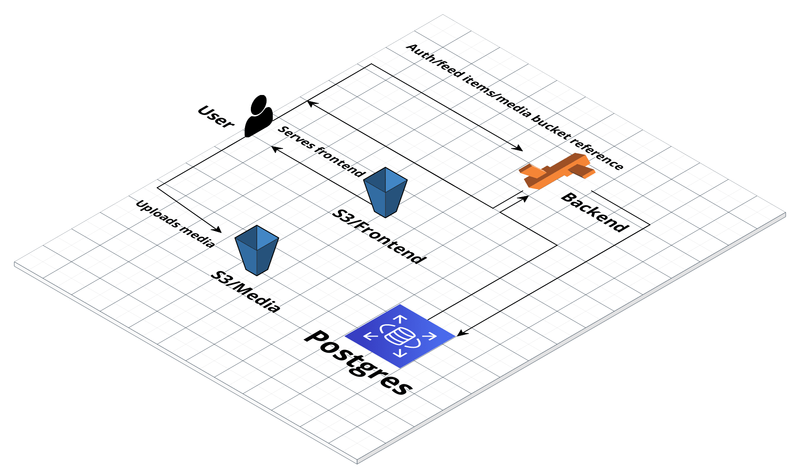

## Infrastructure

Udagram is built on AWS services:

- S3 Buckets
- Elsatic Beanstalk
- RDS

---

## S3

There're 3 S3 buckets:

- One used to host the frontend app
- One used for storing elastic beanstalk backend app versions
- One used to store media uploaded by users

---

## Elastic beanstalk

Used as the backend server and connects to the database on RDS

---

## RDS

A postgres database instance is hosted on RDS and stores user data and references to the media in the S3 bucket.
