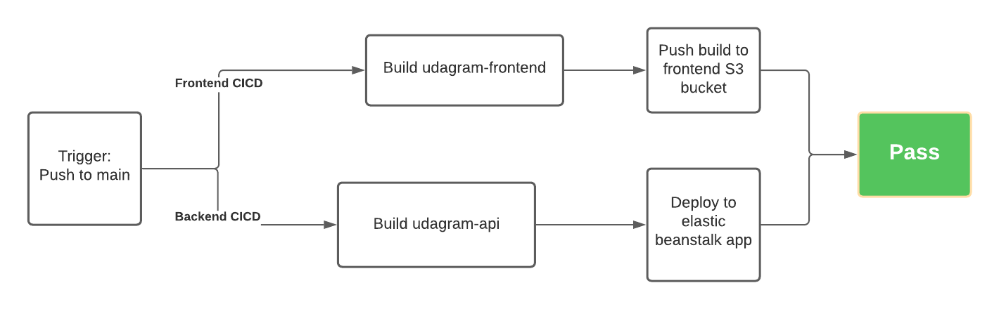

# Pipeline

## Diagram

Both these jobs run in parallel:

- Frontend CICD
- Backend CICD

## Frontend CICD

    1. Builds udagram-frontend
    2. Pushes build folder content (www) to frontend s3 bucket

## Backend CICD

    1. Builds udagram-api
    2. Deploys build folder content (www) to Elasticbean stalk

If both jobs succeed the pipeline passes
